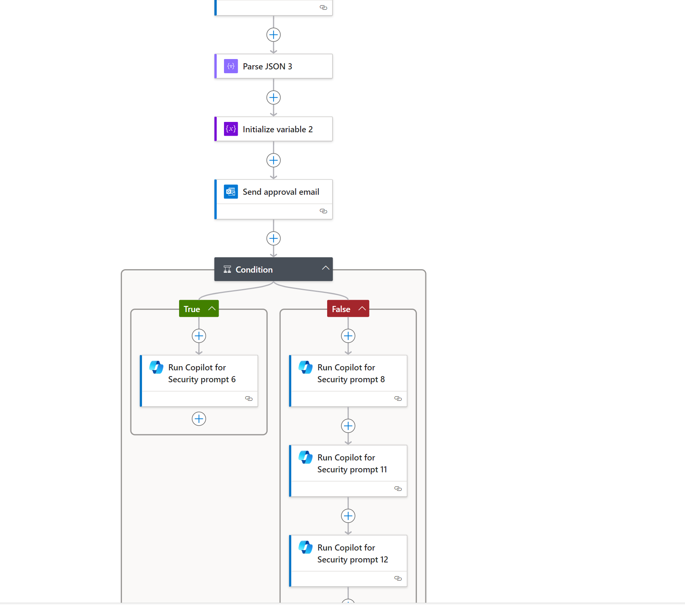
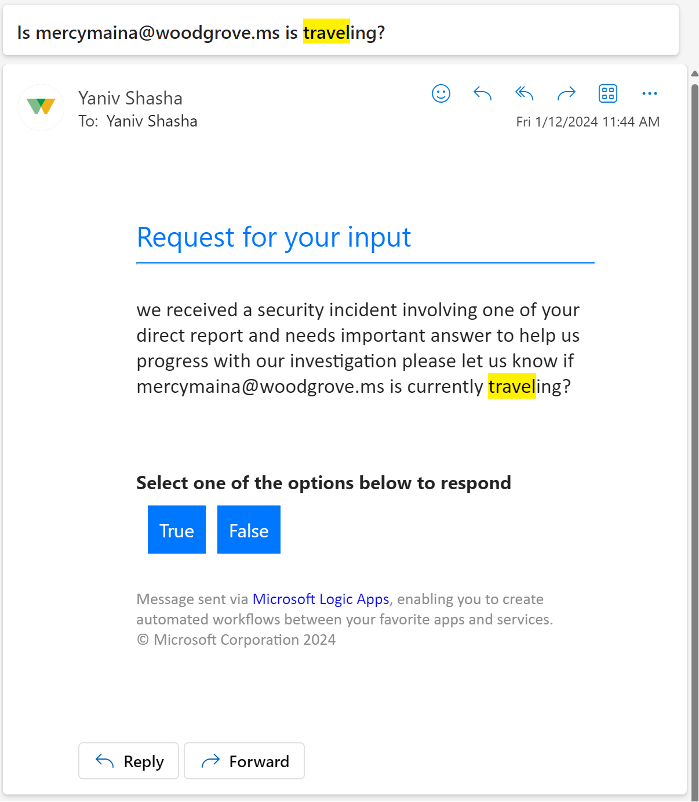

# Security Copilot-isUserTravel
Author: Yaniv Shasha

Activating the 'Deploy' button initiates the deployment of an Azure Logic App integrated with Security Copilot Actions, utilizing a Microsoft Sentinel incident trigger.
The Logic App is configured to run when a new incident is created in Sentinel. This Logic App works best on the following incident types: 

- **Suspicious behavior: Activity from infrequent country or region**  
- **Suspicious behavior: Impossible travel activity**  

After Copilot conducts an investigation, it identifies the user's manager (from the Sentinel UEBA table) and sends them an email with a question about the user's travel status. If the manager responds with a "yes," we are likely dealing with a false positive. Therefore, Copilot adds the manager's answer to its context and writes a report that includes it. 
If the manager responds that the user is not traveling, the investigation continues, focusing on identity prompts. 

### Prerequisites

Prior to beginning the installation process, it's crucial to confirm that you have met the following prerequisites:  
• The user that will deploy this Logic app need to have a Contributor Role. 
• You enabled the Security Copilot license on your tenant  
• The user authenticated within the CoPilot logic app action and has permission to send emails.. 

 

• This logic app can be run in a manual way, or in automatic way, if you select the automated way, you will need to create a new automation rule in Sentinel and configure this logic app as an action. 

 

### Deployment 

To deploy the above logic app, you need to 
•   Press on the Deploy option, select your subscription and the resource group (select the same tenant that Security Copilot is enabled) 

 

### Post Deployment

•   Authenticate with the users mention above (you can use different user for the Copilot actions and to the sentinel actions) 
•   To run the logic app in a manual way, open Microsoft Sentinel incident page, right click on specific incident and press run playbook, select logic app you just deploy and press run. 
•   To run the logic in automatic way, create an automation rule in sentinel and connect this playbook as the action for this rule. 

#### The Email Question example

 

 

