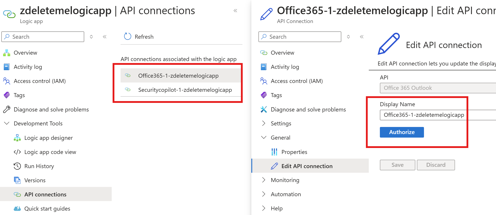

# User Submitted Phishing Analysis with Security Copilot
Author: Yaniv Shasha & Craig Freyman
This solution automates the analysis of user-submitted phishing emails using Security Copilot. It monitors a shared inbox, triggering a Logic App upon new email arrival. The Logic App processes the email using a Function App, which extracts relevant details, leverages the MDTI Security Copilot Skills for reputation insights, and sends the results to an email recipient. 

## Deploy the Solution

### Step 1: Deploy the Function App

Click the button below to deploy the Function App. You'll be prompted to select or create a resource group and provide a unique Function App name. Ensure the Function App is fully deployed before starting the Logic App deployment.

[](https://portal.azure.com/#create/Microsoft.Template/uri/https%3A%2F%2Fraw.githubusercontent.com%2FAzure%2FCopilot-For-Security%2Fmain%2FLogic%2520Apps%2FSecCopilot-UserReportedPhishing-FuncApp_parsing%2Ffunctionapp_azuredeploy.json)

If you run into issues, you can create a skelton/empty Function App and deploy via the commandline:
`az functionapp deployment source config-zip --resource-group yourresourcegroup --name youremptyfunctionapp --src .\FunctionApp.zip` <- ZIP downloaded to your local directory.

### Step 2: Deploy the Logic App

Click the button below to deploy the Logic App. Note your Function App name & resource group from the previous step. You will enter this information in the deployment screen. 

[](https://portal.azure.com/#create/Microsoft.Template/uri/https%3A%2F%2Fraw.githubusercontent.com%2FAzure%2FCopilot-For-Security%2Fmain%2FLogic%2520Apps%2FSecCopilot-UserReportedPhishing-FuncApp_parsing%2Flogicapp_azuredeploy.json)


### Step 3: Initialize O365 and Security Copilot API connections

Open your new Logic App.

Click "API Connections"


Authorize both of the API connections.


### Step 4: Enable the Logic App


### Deployment Notes
If you want to change the function app code you can git clone the repo. Every time you change the FunctionApp code, be sure to repackage the FunctionApp.zip file. The zip file is what is referenced when the solution is deployed. The .python_packages folder is required in this deployment scenario. I can't figure out how to get Azure FunctionApps to install python libraries automatically.

## Function Details
There are five functions in the functionapp:

### 1. parse_email
This Python Azure Function App is designed to handle HTTP requests containing raw email data. Its primary capabilities include:

**Email Parsing**:
    - Extracts key metadata (e.g., sender, receiver, return path, subject, date).
    - Retrieves the main body content, handling multipart emails, and cleans forwarded messages.
    - Identifies DKIM, SPF, and DMARC authentication results from email headers.
    - Processes attachments, computes SHA-256 hashes, and captures base64 content and MIME type.

**URL Extraction and Processing**:
   - Extracts URLs from both HTML and plain text email bodies.
   - Decodes Microsoft SafeLinks and expands shortened URLs by following redirections.
   - Deduplicates URLs to unique base URLs if the count exceeds 20, removing any HTML tags.
   - Filters out image URLs and ensures URL validity.

**Domain Extraction and IP Filtering**:
   - Identifies domains and filters them to ensure validity.
   - Distinguishes between public and non-public IPs using regex patterns and the `ipaddress` library.
   - Returns extracted public IPs and URLs for security and analytics purposes.

**Recursive Parsing**:
   - Recursively parses content (including nested JSON) to extract domains, IPs, and URLs, facilitating structured email content analysis.
   
**HTML and Content Cleaning**:
   - Removes excessive newlines and strips HTML tags for cleaner text content in the response.

**Error Handling**:
   - Provides comprehensive error handling and logging for various failure points, including malformed data or parsing errors.

The function returns a JSON response containing parsed email data, extracted URLs, public IPs, and cleaned domains, making it suitable for integration with security and analytics workflows.

### 2. parse_virustotal_json
This Python Azure Function App is designed to handle HTTP requests containing a VT JSON obect for easy filtering. The VT API returns too much data for generative AI.

**Request Parsing**:
   - Accepts and parses a JSON object from the HTTP request, specifically expecting a `data` object containing `attributes` with `last_analysis_results`.

**Malicious or Suspicious Detection**:
   - Extracts analysis results from `last_analysis_results`, filtering entries where the `category` is labeled as either "malicious" or "suspicious."
   - For each flagged entry, it gathers details like the `engine_name`, `method`, and `result` used by VirusTotal's analysis engines.

**Response Generation**:
   - Returns a JSON response listing all malicious or suspicious findings, including relevant detection engine details, making it useful for further threat intelligence processing or alerting.

**Error Handling**:
   - Logs errors if parsing fails or if the JSON structure is unexpected, returning a 500 error with a message.

### 3. normalize_json
This Azure Function App is an HTTP-triggered function designed to clean and validate JSON input by removing markdown notations and handling `null` values. It's primary purpose is to accept the Security Copilot generated JSON notation in markdown and clean it up to be a JSON object.

**Markdown Notation Removal**:
   - Strips markdown annotations, including triple backticks (```json) and alternate markdown notations like `~~~json`, from the JSON input, cleaning the text for valid JSON parsing.

**Null Value Replacement**:
   - Recursively replaces all `null` values in the JSON object with the string `"None"`, allowing for cases where `null` needs to be preserved as text for output or further processing.

**Response Generation**:
   - Returns a cleaned and formatted JSON string as the response, making it easy to read and ready for further use.

**Error Handling**:
   - Catches JSON decoding errors if the input is improperly formatted and returns a 400 error with a helpful message.
   - Logs any unexpected errors and returns a 500 error, ensuring robustness.

### 4. json_to_html
This Azure Function App is an HTTP-triggered function designed to generate an HTML phishing analysis report from JSON data. 

**HTML Report Generation**:
   - Uses Jinja2 templating to create a detailed, stylized HTML report from JSON input, with sections for "Final Evaluation," "Email Body Analysis," "Attachment Review," "Domain Evaluation," and "URL Evaluation."
   - Highlights key findings with custom colors based on values such as `Classification`, `Confidence Level`, and `Phishing Likelihood`.
   - Formats lists, tables, and indicators, creating a clear, structured layout for easy analysis.

**JSON Parsing and Validation**:
   - Parses JSON data from the HTTP request body and validates that it is a list of JSON objects, issuing a 400 error if not in the expected format.
   
**Customizable Section Order**:
   - Processes sections in a predefined order, ensuring consistent HTML structure, even if sections appear in a different order in the input JSON.

**Error Handling**:
   - Catches JSON parsing errors and other unexpected exceptions, returning informative HTTP responses (400 for invalid JSON format and 500 for other issues).

### 5. parse_pdf
This Azure Function App is an HTTP-triggered function that processes a base64-encoded PDF file in the request body, extracts text, and returns it in a cleaned format. The text is then appended to the 'email_body' variable in the Logic App.

**Base64 PDF Decoding**:
   - Accepts the PDF as a base64-encoded string in the HTTP request body, either directly or within a JSON payload (`body` field). 
   - Supports optional data URI prefixes, stripping these before decoding.

**PDF Text Extraction**:
   - Uses `pdfminer` to extract raw text from the PDF file, handling binary data from the decoded base64 string.

**Text Cleanup**:
   - Performs post-processing on the extracted text to remove non-printable characters and reduce excessive whitespace, returning a clean and compacted text output.

**Error Handling**:
   - Logs decoding errors, JSON parsing issues, and unexpected exceptions, providing informative responses:
     - 400 status for invalid base64 or JSON formatting.
     - 500 status for unexpected processing errors, with detailed logging for debugging.
