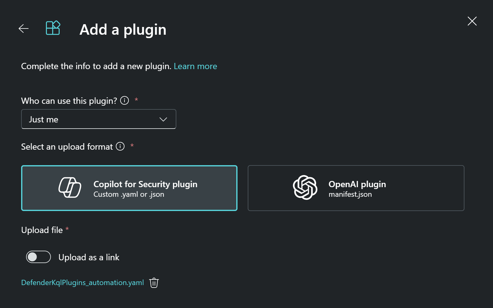
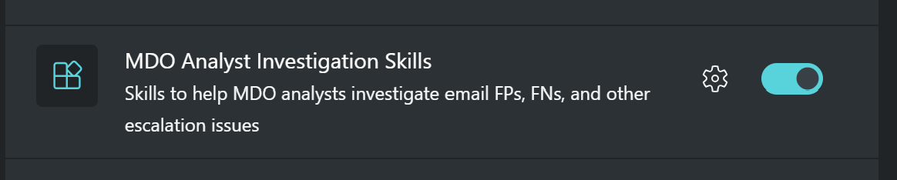
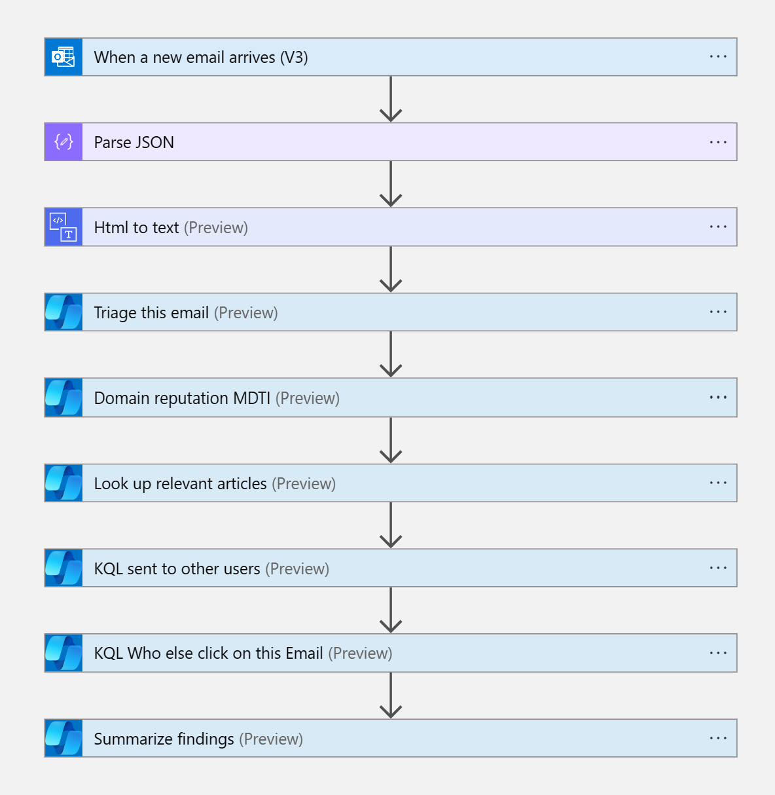

# Sec-Copilot-UserReportedPhishing
Author: Yaniv Shasha

By initiating the deployment process, you will set up an Azure Logic App integrated with Security Copilot Actions. 
This setup activates when a user reports a phishing attempt in Outlook. 
As configured by Defender for Office, these reported emails are rerouted to a designated shared mailbox. 
Each new email arriving in this shared mailbox triggers the Security Copilot automation, initiating an automated investigation process.  
During this phase, Security Copilot examines the email to determine the likelihood of it being a phishing attempt. 
Depending on the assessed risk level, the system will send a notification email. 
Additionally, if the phishing probability exceeds 75%, a Sentinel Incident will be automatically generated. 

### Before starting the installation, ensure you have fulfilled these prerequisites:

• The user deploying this Logic app must possess a Contributor Role. 
• Activation of the Security Copilot license on your tenant is required. 
• The user authenticated in the Copilot logic app action should have Security Admin permissions and the role of a Microsoft Sentinel contributor, as this is necessary for creating incident comments. 
• Upload and enable custom KQL plugin, this need to be on the same user profile that running automation.  

 
 

 

### Deployment 

To deploy the above logic app, you need to 
•   Press on the Deploy option, select your subscription and the resource group (select the same tenant that Security Copilot is enabled) 

<a href="https://portal.azure.com/#create/Microsoft.Template/uri/https%3A%2F%2Fraw.githubusercontent.com%2FAzure%2FCopilot-For-Security%2Fmain%2FLogic%2520Apps%2FSecCopilot-UserReportedPhishing%2Fazuredeploy.json" target="_blank">

###  Full Logic App view

