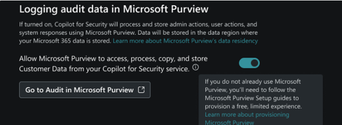
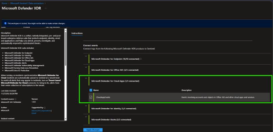

# Ingest Copilot for Security Audit logs  
Auditing is a critical feature in any security solution, providing visibility into user activities and system events, detect usage and activities anomalies, and ensure compliance with regulatory requirements. By sending Copilot for Security audit logs into your cloud native SIEM - Microsoft Sentinel, users can gain deeper insights into their Security Copilot usage and take proactive measures to mitigate risks  

# Prerequisites  
### Enable the audit log capability in Security Copilot  
During the first run experience, a Security Administrator is given the option of opting into allowing Microsoft Purview to access, process, copy and store admin actions, user actions, and Copilot responses. For more information, see Get started with Security Copilot.  

Security Administrators can also access this option through the Owner settings page.  

Use the following steps to update the audit log settings:  

1. Sign in to Security Copilot (https://securitycopilot.microsoft.com).  
2. Select the home menu icon.  
3. Navigate to the Owner settings > Logging audit data in Microsoft Purview.  
   

### Enable Microsoft Defender for Cloud Apps logs via Microsoft Defender XDR Data connector  
To integrate with Microsoft Defender XDR make sure you have:  
1. Sentinel Log Analytics Workspace: read and write permissions.  
2. Connector Access Control: the user applying changes to the connector must be a member of the Microsoft Entra ID associated with the tenant that the workspace belongs to.  
3. Tenant Permissions: 'Global Administrator' or 'Security Administrator' on the workspace's tenant.  
4. License: M365 E5, M365 A5 or any other Microsoft Defender XDR eligible license.  

   

 

### Deploy Analytical Rules

### Deploy Workbook 

