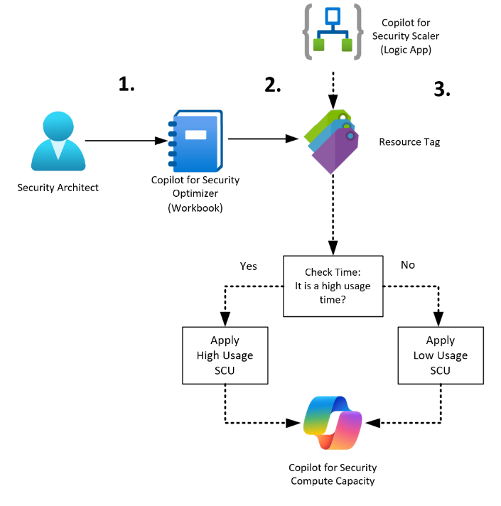
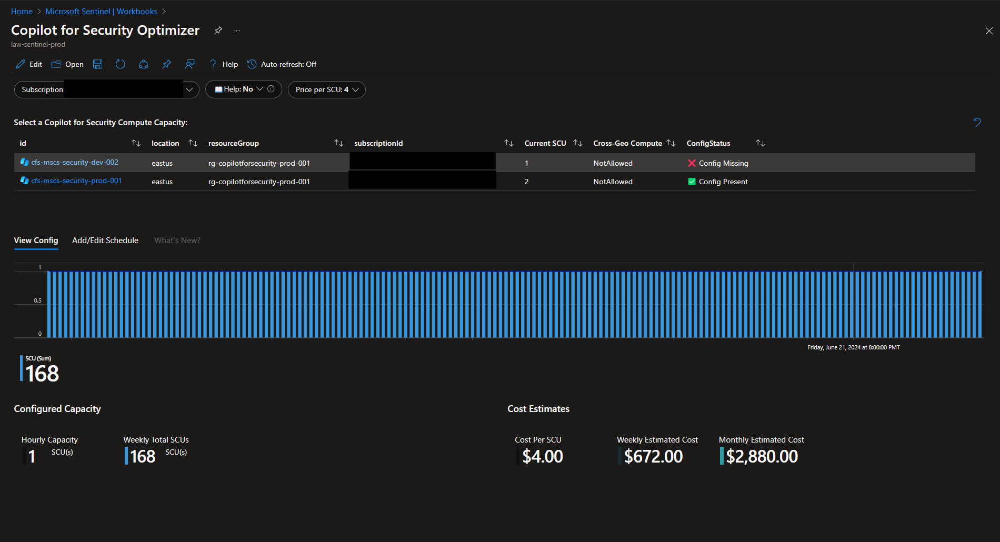
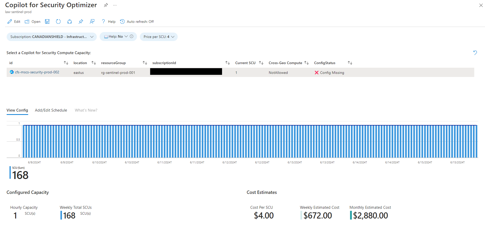
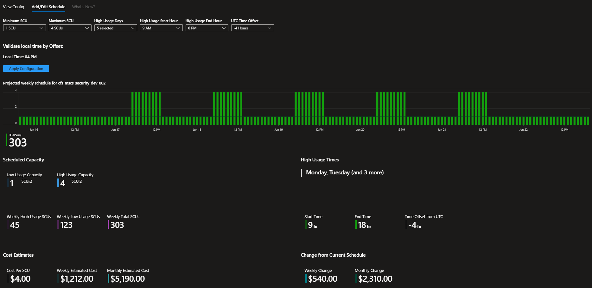
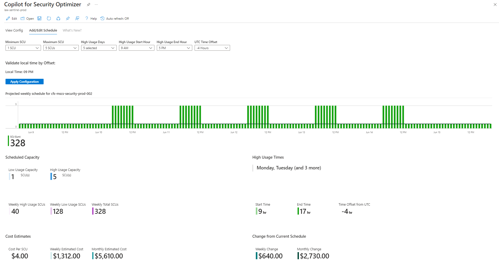
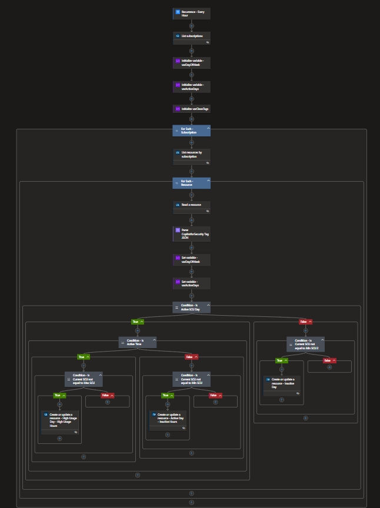
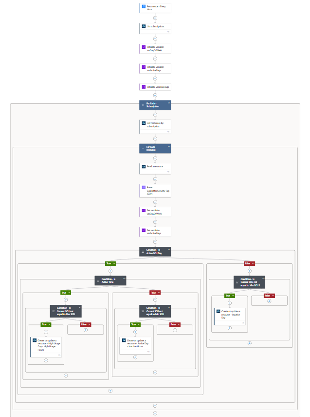

# SCU Capacity Optimizer
Author: Lachlan Watson

This solution will allow you to view and control the Copilot for Security Compute Capacity SCUs based on a schedule.<br>
The solution is created using 2 core components:
- Sentinel Workbook - Copilot for Security Optimizer
- Playbook (Logic App) - Copilot for Security Scaler

In the event of a SOC operating in a more limited capacity than 24x7 such as 8x5 this can mean significant cost savings by allowing the playbook to scale the compute capacity according to the schedule that has been applied while still taking advantage of the robust capabilities from Copilot for Security.<br>



The Copilot for Security Optimizer Sentinel solution offers 3 core features:<br>

1. View - Security teams can view existing scheduling (or lack there of) on a Compute Capacity, and displays predicted costs of the solution

2. Modify - Security architects can add/modify existing schedules, view cost calculations based on the new schedule, and compare it with the existing config. This is achieved by applying a Resource Tag called: **CopilotforSecurityConfig**.

3. Apply - Finally, the Playbook/LogicApp runs hourly (5 minutes after the hour, to avoid conflict with other automations), to find resources with the CopilotforSecurityConfig tag applied, then for each compute capacity evaluates high usage schedule configuration to determine the correct SCU count, then applies if any changes need to be made.

The CopilotforSecurityConfig tag holds the information required by the Playbook to apply separate configs across multiple compute capacities.

Here is the structure of the Resource Tag:

```json
    {
    "SCULimits": {
            "Min": 1, "Max": 3
        },
        "Schedule": {
            "ActiveDays": [
                1, 2, 3, 4
            ],
            "ActiveStartHour": 8,
            "ActiveEndHour": 18,
            "TimeOffset": -6
        }
    }
``` 
Property definitions:
- SCULimits
    - Min: SCU count applied for Low Usage days/times
    - Max: SCU count applied for High Usage days/times
- Schedule
    - ActiveDays: integer representations of days of the week:
        - 0 = Sunday
        - 1 = Monday
        - 2 = Tuesday
        - 3 = Wednesday
        - 4 = Thursday
        - 5 = Friday
        - 6 = Saturday
    - ActiveStartHour: for high usage days, time when Maximum SCU count should be applied
    - ActiveEndHour: for high usage days, time when Minimum SCU count should be applied
    - TimeOffset: Hour offset from UTC. This is leveraged to ensure CfS is operating in the desired local time, and is paired with the workbook to validate offset to local comparison.

## Prerequisites

### Azure Resource Requirements
- Copilot for Security Compute Capacity - So we have something to which we can view/apply a schedule
- Log Analytics Workspace (ideally Sentinel enabled) for operation of the Workbook

### Azure RBAC Requirements
Least-privilege resource deployment requires:
- Workbook - Monitoring Contributor
- Playbook - Logic App Contributor

Post-config requirements:
- Subscription Owner is required to create and apply a least-privilege custom role for the Playbook. You may choose to assign the Contributor role if you do not want to use a custom role.<br>

Usage requirements:
- Contributor access of some kind is required to the Copilot for Security Compute Capacity for any users who will be modifying the schedule since it works by applying Resource Tags to the Compute Capacity.

## Deployment
**Deploy Solution**<br>
[](https://portal.azure.com/#create/Microsoft.Template/uri/https%3A%2F%2Fraw.githubusercontent.com%2FAzure%2FCopilot-For-Security%2Fmain%2FSCU%20Capacity%20Optimizer%2Fsolution%2Fazuredeploy.json)<br>

Note: During deployment, the selected Playbook Resource Group must be different than the Sentinel Resource Group.


## Post-deployment
1. (Optional) Deploy the Copilot for Security Capacity Creator role to each subscription where Copilot for Security Compute Capacities are present for a least-privilege approach<br>
[](https://portal.azure.com/#create/Microsoft.Template/uri/https%3A%2F%2Fraw.githubusercontent.com%2FAzure%2FCopilot-For-Security%2Fmain%2FSCU%20Capacity%20Optimizer%2Fcustomrole%2Fazuredeploy.json)

2. Assign the Copilot for Security Capacity Creator custom role, or Contributor built-in role to the Playbook's managed identity - https://docs.microsoft.com/azure/logic-apps/create-managed-service-identity?tabs=consumption#assign-managed-identity-role-based-access-in-the-azure-portal

3. Open the playbook in the Logic App Designer and ensure connections are displaying correctly<br><br>

## Usage
**Basic usage steps:**

1. The Copilot for Security Optimizer workbook should now be present in your Sentinel workspace. If you don't have Sentinel access, or don't have Sentinel enabled, then you can find the Azure Workbook resource in your Sentinel resource group.

2. Select a Copilot for Security Compute Capacity.  You should see if there is or is not a schedule applied to that Compute Capacity.

3. Select the Edit tab, and select the desired schedule to review the cost changes based on your team's standard work hours.

4. When ready, select the **Apply Configuration** button to deploy the Resource Tags.

5. When the next hour rolls around, the Playbook/Logic app will trigger, evaluate the Resource Tag, and apply the appropriate SCU limit to the Compute Capacity.
    - If you'd like the changes to apply immediately you can manually trigger the Playbook.

[Learn more about Copilot for Security](https://learn.microsoft.com/en-us/copilot/security/microsoft-security-copilot)<br>
[Learn more about Playbooks (Logic Apps)](https://learn.microsoft.com/en-us/azure/logic-apps/logic-apps-overview)<br>
[Learn more about Workbooks](https://learn.microsoft.com/en-us/azure/azure-monitor/visualize/workbooks-overview)<br>

## Screenshots
**Workbook - View No Schedule**<br>

<br><br>
**Workbook - Apply/Modify Schedule**<br>

<br><br>
**Playbook**<br>

