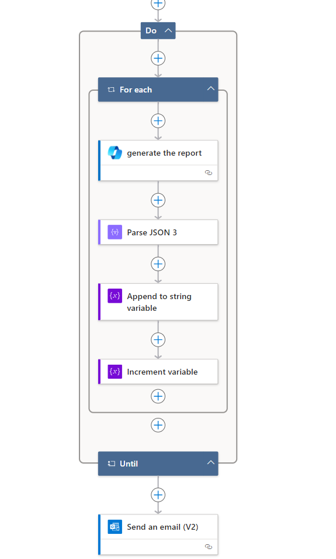
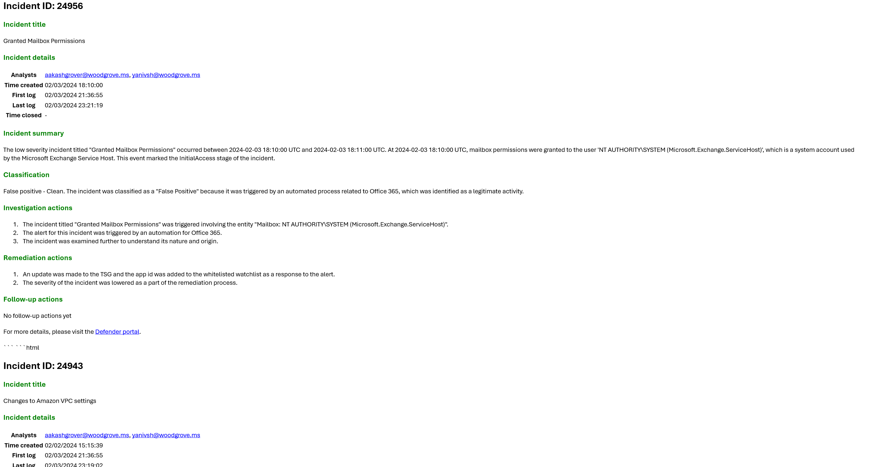

# SecurityCopilot-SOCshift-reporting-transfer
Author: Yaniv Shasha

Activating the 'Deploy' button will initiate the deployment of an Azure Logic App integrated with Security Copilot Actions, which utilizes a Microsoft Sentinel incident trigger.  
The Logic App is configured to run daily, generating a report on all Defender incidents opened within the last 24 hours and currently in progress. CoPilot will then consolidate these incident reports and send them via email to the SOC manager's designated email address.

### Prerequisites

Prior to beginning the installation process, it's crucial to confirm that you have met the following prerequisites:  
• The user that will deploy this Logic app need to have a Contributor Role. 
• You enabled the Security Copilot license on your tenant  
• The user authenticated within the CoPilot logic app action and has permission to send emails.. 

 

• This logic app can be scheduled to run regularly. Our recommendation is to align its schedule with your organization's shift changes in the SOC. Currently, it is set to run every 24 hours, fetching Defender incidents from the past 24 hours. However, this schedule can be adjusted based on demand. 

 

### Deployment 

To deploy the above logic app, you need to 
•   Press on the Deploy option, select your subscription and the resource group (select the same tenant that Security Copilot is enabled) 

 

### Post Deployment

•   Authenticate with the users mention above (you can use different user for the Copilot actions and to the sentinel actions) 
•   To run the logic app in a manual way, open Microsoft Sentinel incident page, right click on specific incident and press run playbook, select logic app you just deploy and press run. 
•   To run the logic in automatic way, create an automation rule in sentinel and connect this playbook as the action for this rule. 

#### The Email Report example

 

 

