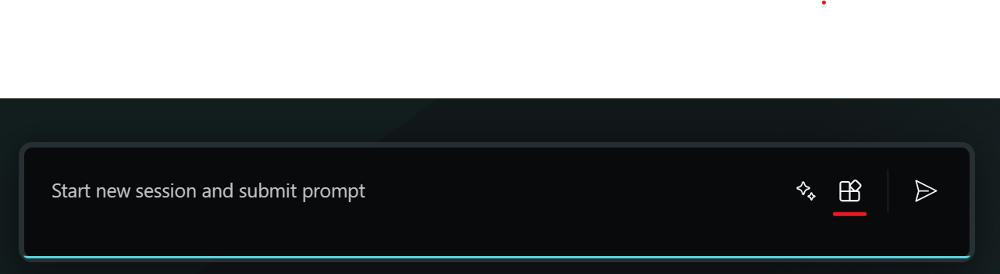
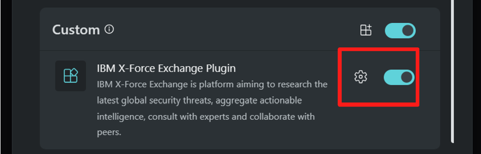
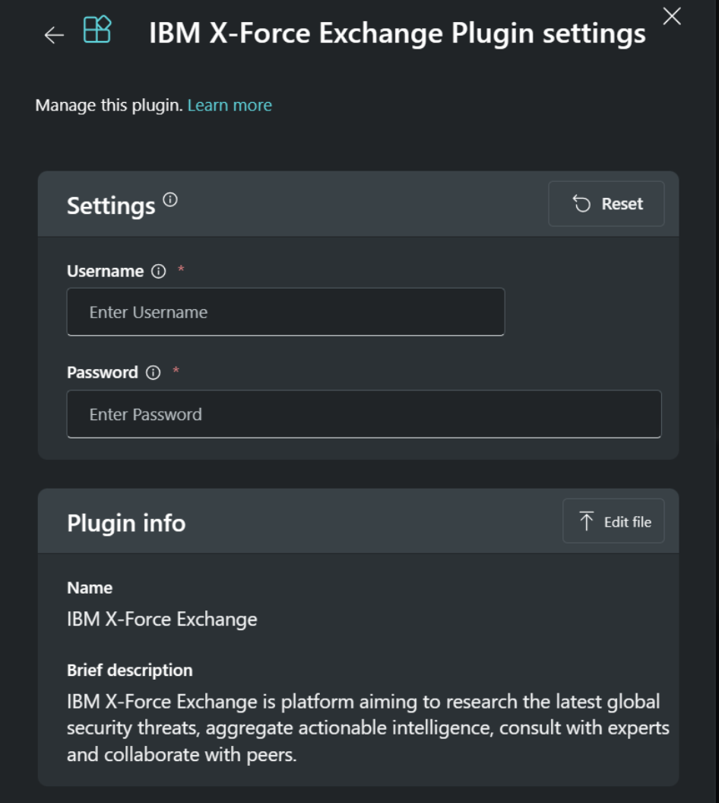

# # IBM X-Force Thread Intelligence
**Publisher: Microsoft**

Product Information:
https://www.ibm.com/products/xforce-threat-intelligence

## Overview  
IBM X-Force is an online platform designed to help you understand and respond to security threats. It's a cloud service that lets you access, distribute, and take action on information about potential security risks. With this platform, you can quickly find out about new security threats around the world, gather information that you can use to protect yourself, talk to experts for advice, and work with other people who are also trying to stay safe. IBM X-Force Exchange is powered by both human expertise and automated processes, and it uses IBM X-Force's extensive resources to help users get ahead of threats that are just starting to appear. 

## Invoking the Plugin and Skills

1. A window entitled, Manage plugins, will open. Scroll down, until you see the IBM X-Force plugin.

2. Click on the Setup button for the IBM X-Force plugin highlighted in the image above, a new model will appear.

3. Enter the IBM X-Force API key and password in the Value input box and click on the Save button. Once saved, you would see an acknowledgement.

4. Use the IBM X-Force Skillset
   1. Make sure the IBM X-Force Plugin is enabled, verify by navigating to the Manage plugins tab and making sure the toggle is active.
   2. Run a sample prompt such as `how me the IBM whois for www.bing.com.`

## Skills & Prompts

1. Get Threat Intelligence Reports IBM: Get premium threat intelligence reports based on a given report type
   - Example Prompt(s): 
     - Tell me about recent IBM threat intelligence report
     - Show me IBM X-Force threat intelligence reports
   - Inputs: 
     - reportType
       - Description: The type of Threat Intelligence report. Possible report types are threatanalysis, osintadvisory, malware, industry, and threatgroup. 
       - Required: true
       - Type: string
       - Example: "threatanalysis"
     - added_after
       - Description: To get reports created after specified date, For example, 2022-10-12. If not specified, the query will return the newest IPs.
       - Required: false
       - Type: string
       - Example: "2022-10-12"
     - added_before
       - Description: To get reports created before specified date, For example, 2022-10-12. If not specified, the query will return the newest IPs.
       - Required: false
       - Type: string
       - Example: "2022-10-12"
     - limit
       - Description: The number of returned Malware Analysis Reports, default value is 200. The limit must not be larger than 200.
       - Required: false
       - Type: integer
       - Example: 201
     - skip
       - Description: The startingpoint to retrieve entries, default value is 0
       - Required: false
       - Type: integer
       - Example: 10
2. Get Threat Group Profiles IBM: Get a List of Threat Group Profiles.
   - Example Prompt(s): 
     - What are the most recent X-Force threat group profiles?
     - What are the IBM threat group profiles?
     - Show me the top 20 IBM threat group profiles.
   - Inputs: 
     - limit
       - Description: The number of returned Malware Analysis Reports, default value is 200. The limit must not be larger than 200.
       - Required: false
       - Type: integer
       - Example: 201
     - skip
       - Description: The startingpoint to retrieve entries, default value is 0
       - Required: false
       - Type: integer
       - Example: 10
3. Get Dns Records IBM: Verify a domain name, IP address, or URL against IBM X-Force DNS records.
   - Example Prompt(s): 
     - Show me the IBM DNS records for www.bing.com
     - What are the IBM X-Force DNS records for https://www.bing.com/search?q=microsoft&form=QBLH&sp=-1&lq=0&pq=microsof&sc=11-8&qs=n&sk=&cvid=166E76706804404BAA7390129EE88004&ghsh=0&ghacc=0&ghpl=?
     - What is the IBM DNS record for www.https://www.microsoft.com/?
   - Inputs: 
     - input
       - Description: The domain name, IP Address, or URL to check for DNS information.
       - Required: true
       - Type: string
       - Example: "www.bing.com"
4. Get WHOIS IBM: Returns the WHOIS information for an IP, URL, or domain.
   - Example Prompt(s): 
     - Show me the IBM whois records for www.bing.com
     - What is the IBM WHOIS for https://www.bing.com/search?q=microsoft&form=QBLH&sp=-1&lq=0&pq=microsof&sc=11-8&qs=n&sk=&cvid=166E76706804404BAA7390129EE88004&ghsh=0&ghacc=0&ghpl=?
     - IBM WHOIS www.https://www.microsoft.com/?
   - Inputs: 
     - host
       - Description: The domain name,IP Address, or URL to check for WHOIS information.
       - Required: true
       - Rype: string
       - Example: "www.bing.com"