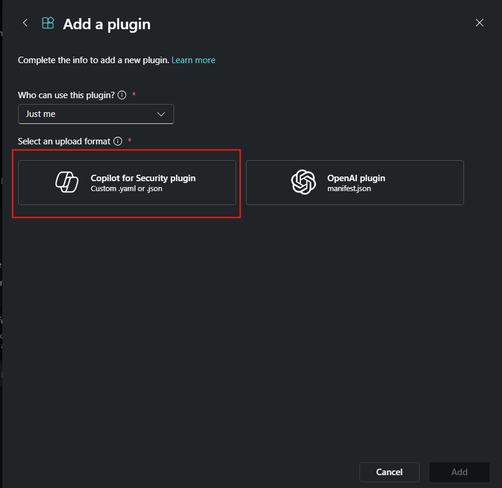

# eDiscovery Plugin for Copilot for Security
Author: Amit Singh

The custom plugin for Copilot for Security offers a range of functionalities to enhance your organization's eDiscovery capabilities in Microsoft Purview. Use this plugin if you create the case and then export the artifacts, if you attach search to review set then this plugin will not work. 

Pre-requisites

* [Copilot for Security Enabled](https://learn.microsoft.com/en-us/security-copilot/get-started-security-copilot#onboarding-to-microsoft-security-copilot)
* [Access to upload custom plugins](https://learn.microsoft.com/en-us/security-copilot/manage-plugins?tabs=securitycopilotplugin#managing-custom-plugins)
* [EntraID Application Registration created](https://learn.microsoft.com/en-us/graph/auth-register-app-v2#register-an-application) Make sure your application has the following delegated graph permissions: eDiscovery.Read.All & eDiscovery.ReadWrite.All
* 
* 

### Instructions
#### Upload the Custom Plugin

* Obtain the file [eDiscovery_OAuth_API_manifest.yaml](https://github.com/samitks77/Copilot-For-Security/blob/main/Plugins/Community%20Based%20Plugins/Purview/eDiscovery/eDiscovery_OAuth_API_manifest.yaml) from this directory. This is the yaml that you will upload in Copilot for Security. From your EntraID App registration, add the ClientId & tenant ID. 
* During the upload process as a custom plugin in Copilot for Security you will need to have your Secret Value from Certificates & secrets handy as that will be your API key for this plugin to work. Copy your secret value once the secret is created because if you navigate away from this screen, your secret value would be obfiscuated.  Follow these steps to create the secrets(https://learn.microsoft.com/en-us/graph/auth-register-app-v2#add-credentials).
* Upload eDiscovery_OAuth_API_manifest.yaml to Copilot for Security by navigating to custom plugins at the bottom of the Manage Sources page. 
* Upload the file by clicking on Copilot for Security plugin. 
* Paste the Client Secret Value from EntraID App Registration & click connect  It should open another window where you

### Skills & Prompts
1. Create eDiscovery Case: 
   - Example Prompt(s): 
     - Create eDiscovery case in Purview with the Case name "Test-123", response should be a bulleted list
   - Inputs: [Case name]
2. Add custodian to eDiscovery Case: 
   - Example Prompt(s): 
     - Add custodian to the eDiscovery case in Purview, use the case id from above or use this Case ID "1xxxx234-XXXX-XXXX-a1cd- 
       fxxxxxxxxxx0" and add this email for the custodian "test@test123.com" 
   - Inputs: [Email]
   - Inputs: [Case ID]
3. Apply hold on eDiscovery Custodian 
   - Example Prompt(s): 
     - Apply hold on eDiscovery custodians using the custodian id from above or use this Custodian ID "2xxxxxxxxxxxxxxxxxxxxxxxxxxxxxx6" 
   - Inputs: [Custodian ID]
4. Add new userSource objects to Custodians 
   - Example Prompt(s): 
     - add new userSource object associated with the eDiscovery custodian id "2xxxxxxxxxxxxxxxxxxxxxxxxxxxxxx6", include this 
       custodian email "test@test123.com" and Mailbox, site for sources. 
   - Inputs: [Custodian ID]
   - Inputs: [Email]
5. Add new eDiscovery Search object to the Case 
   - Example Prompt(s): 
     - Add a new ediscoverySearch object with this Case ID "1xxxx234-XXXX-XXXX-a1cd-fxxxxxxxxxx0" with the display name "Test-123- 
       search", also add dataSourceScopes to allTenantMailboxes, allTenantSites, allCaseCustodians.
   - Inputs: [Case ID]
   - Inputs: [Display Name]
6. Run an estimate on eDiscovery Case: 
   - Example Prompt(s): 
     - Run an estimate of the number of emails and documents in eDiscovery with this Search ID "2xxxxxxx-xxx4-xxxd-4xxx- 
       5xxxxxxxxxxx" or the Search ID from above
   - Inputs: [Search ID]
7. Create new eDiscovery ReviewSet: 
   - Example Prompt(s): 
     - Create new ediscoveryReviewSet for the above case id or use this Case ID "1xxxx234-XXXX-XXXX-a1cd- 
       fxxxxxxxxxx0" with the Display Name of "Test-123-reviewset"
   - Inputs: [Case ID]
8. Initiate an Export in eDiscovery: 
   - Example Prompt(s): 
     - Use this Case ID "1xxxx234-XXXX-XXXX-a1cd-fxxxxxxxxxx0" or the Case ID from above & this ReviewSetId "dxxxxxxx-xxxx-xxxx-xxxx- 
       xxxxxxxxxxxx" or the ReviewSetId from above and initiate an export
   - Inputs: [Case ID]
   - Inputs: [Review Set ID]
9. Get a list of Case Operation in eDiscovery: 
   - Example Prompt(s): 
     - Use the Case ID from above or use this Case ID "1xxxx234-XXXX-XXXX-a1cd-fxxxxxxxxxx0", get a list of the caseOperation objects 
       and their properties
   - Inputs: [Case ID]

