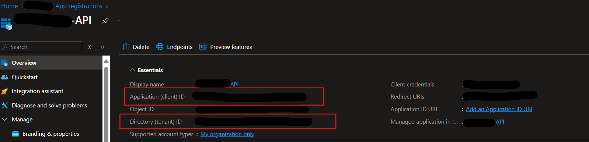

# eDiscovery Plugin for Copilot for Security
Author: Amit Singh

The custom plugin for Copilot for Security offers a range of functionalities to enhance your organization's eDiscovery capabilities in Microsoft Purview. Use this plugin if you create the case and then export the artifacts, if you attach search to review set then this plugin will not work. 

Pre-requisites

* [Copilot for Security Enabled](https://learn.microsoft.com/en-us/security-copilot/get-started-security-copilot#onboarding-to-microsoft-security-copilot)
* [Access to upload custom plugins](https://learn.microsoft.com/en-us/security-copilot/manage-plugins?tabs=securitycopilotplugin#managing-custom-plugins)
* [EntraID Application Registration created](https://learn.microsoft.com/en-us/graph/auth-register-app-v2#register-an-application) Make sure your application has the following delegated graph permissions: eDiscovery.Read.All & eDiscovery.ReadWrite.All
* 
* 

### Instructions
#### Upload the Custom Plugin

* Obtain the file [eDiscovery_OAuth_API_manifest.yaml](https://github.com/samitks77/Copilot-For-Security/blob/main/Plugins/Community%20Based%20Plugins/Purview/eDiscovery/eDiscovery_OAuth_API_manifest.yaml) from this directory. This is the yaml that you will upload in Copilot for Security. From your EntraID App registration, add the ClientId & tenant ID. 
* During the upload process as a custom plugin in Copilot for Security you will need to have your Secret Value from Certificates & secrets handy as that will be your API key for this plugin to work. Copy your secret value once the secret is created because if you navigate away from this screen, your secret value would be obfiscuated.  Follow these steps to create the secrets(https://learn.microsoft.com/en-us/graph/auth-register-app-v2#add-credentials).
* Upload eDiscovery_OAuth_API_manifest.yaml to Copilot for Security by navigating to custom plugins at the bootom of the Manage Sources page. 

### Skills & Prompts
Look up IP address: Ask CrowdSec about an IP
Example Prompt(s):
What can CrowdSec tell me about this IP: [IP]
According to CrowdSec what are the top targeted countries by this IP: [IP]
Inputs: [IP]
  
