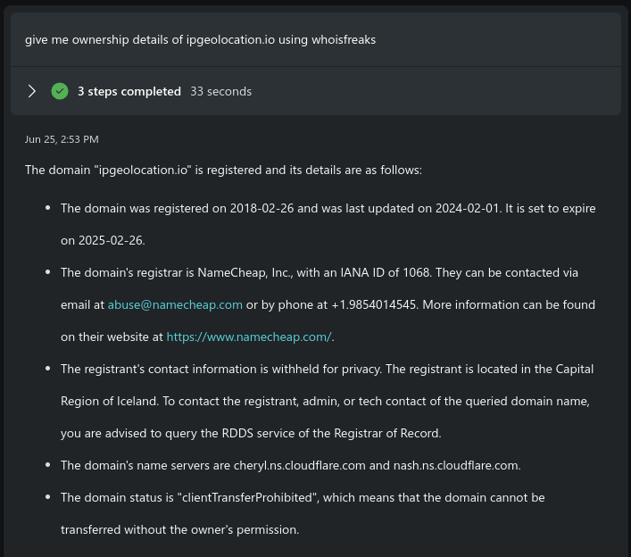
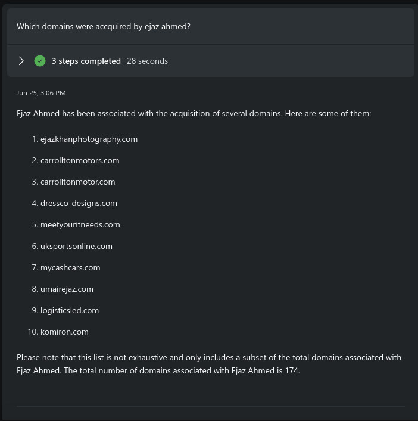
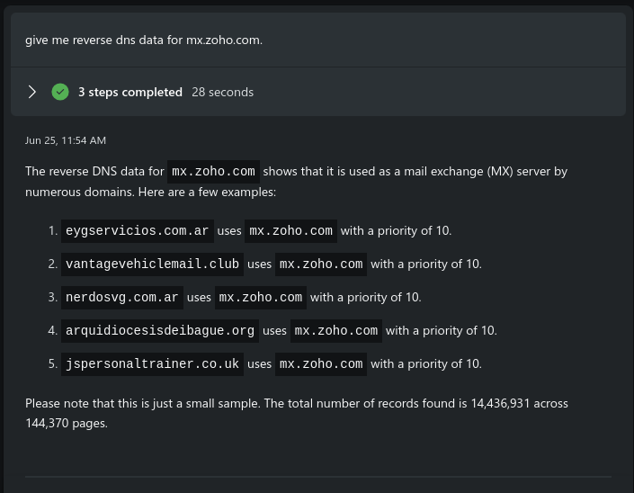
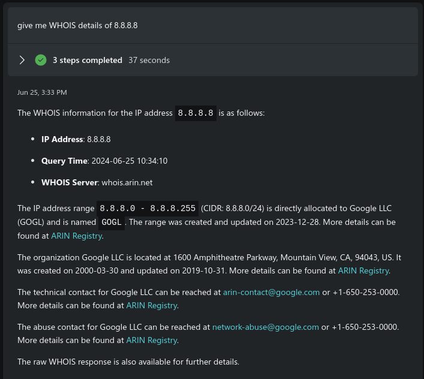

# Copilot for Security Custom Plugin - API - Get Domain and IP Information from whoisfreaks

#### Copilot for security to perform threat intelligence, utilizing enriched domain and IP data, powered by WhoisFreaks.

### Pre-requisites

* [Copilot for Security Enabled](https://learn.microsoft.com/en-us/security-copilot/get-started-security-copilot#onboarding-to-microsoft-security-copilot)
* [Access to upload custom plugins](https://learn.microsoft.com/en-us/security-copilot/manage-plugins?tabs=securitycopilotplugin#managing-custom-plugins)
* [Get your free API Key from whoisfreaks](https://whoisfreaks.com/signup.html)

### Instructions

#### Upload the Custom Plugin

1. Obtain the file [whoisfreaks-manifest.yaml](whoisfreaks-manifest.yaml).
2. [Upload the custom plugin](https://learn.microsoft.com/en-us/security-copilot/manage-plugins?tabs=securitycopilotplugin#add-custom-plugins) and verify it's activated.
3. After uploading the plugin put in your [whoisfreaks API Key](https://learn.microsoft.com/en-us/security-copilot/plugin_api#configure-authentication-1).

### Plugin Utilization
Here are a few sample prompts, but you can delve deeper into cybersecurity analysis. For a complete overview, visit our products at [whoisfreaks.com](https://whoisfreaks.com).

* give me ownership details of ipgeolocation.io using whoisfreaks
* which domains were accquired by ejaz ahmed?
* give me reverse dns data for mx.zoho.com.
* give me domains hosted on 8.8.8.8
* give me WHOIS details of 8.8.8.8

