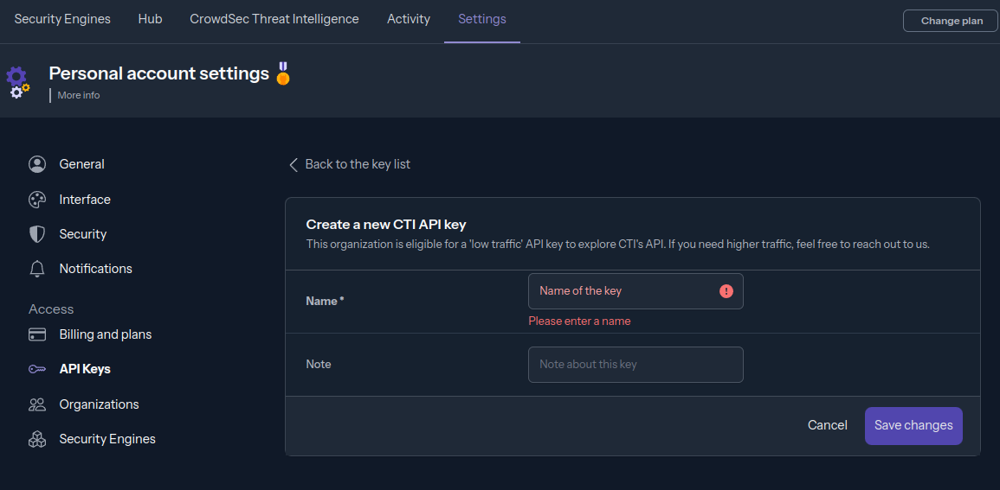
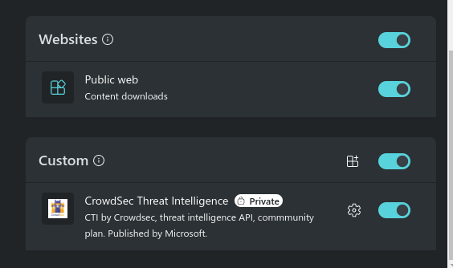
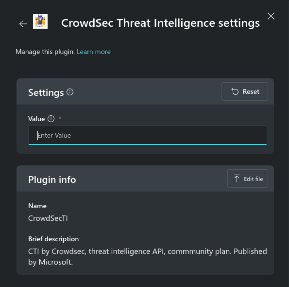

# CrowdSec Threat Intelligence

This plugin allows users to enhance their IP investigations with threat intelligence sourced from **CrowdSec** and get insights such as:
   - Curated IP and IP range reputations
   - Background noise level assessment
   - Detailed records of malicious behaviors
   - MITRE techniques associated with the IP
   - Countries targeted by the attacker
   - Classification of the attacker
   - Historical activity and aggressiveness metrics (covering the past 24h, 7 days, 30 days, and overall)

[You can find detailed product information here](https://www.crowdsec.net/cyber-threat-intelligence)

## **Pre-requisites**

1. The plugin requires the use of an API key that can be obtained by creating a free account [here](https://app.crowdsec.net/signup).

Once logged in, you can create and manage your API Keys in the **Settings > API Keys** section:

2. From the Plugin manager, locate the CrowdSec Plugin and enable it

3. Click the "Set Up" button, enter the CrowdSec API key and press "Save."

## Invoking the Plugin and Skills

1. Use a Natural Language prompt from the examples below or use Direct Skill Invocation ("/")

## Skills & Prompts

1. Look up IP address: Ask CrowdSec about an IP 
   - Example Prompt(s): 
     - What can CrowdSec tell me about this IP: [IP]
     - According to CrowdSec what are the top targeted countries by this IP: [IP]
   - Inputs: [IP]

## Frequently Asked Questions (FAQ)

1. **Important**: invocation issues
   If prompts fail to invoke, please ensure you're using a supported Prompt above. Otherwise, invoke it using Direct Skill Invocation "/"
