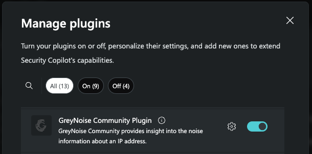
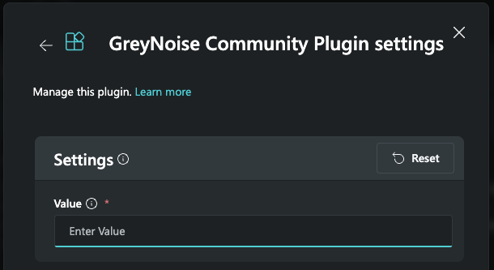

# GreyNoise Community
**Author: Shiv Patel + Brad Chiappetta**
**Publisher: Microsoft + GreyNoise**

This plugin enables users to enrich investigations using threat intelligence from GreyNoise:   
	1. Query information on an IP

Product Information:
https://www.greynoise.io/greynoise-product

**Note**  
This plugin uses the GreyNoise Community (free) API, but still requires a GreyNoise Community (free) account to be [created here](https://viz.greynoise.io/signup).

## **Pre-requisites**
1. From the Plugin manager, locate the GreyNoise Enterprise Plugin and enable it

    ## Invoking the Plugin and Skills
2. **Important**  
   After selecting or uploading, click the "Set Up" button and enter the copied API key from the Pre-requisites above and press "Save."

3. Use a Natural Language prompt from below examples or use Direct Skill Invocation ("/")

## Skills & Prompts
1. Look up IP address noise: Ask GreyNoise about an IP 
   - Example Prompt(s): Tell me about Ip address [IP] using the GreyNoise database
   - Inputs: [IP]

## Frequently Asked Questions (FAQ)
1. **Important**  
   If prompts fail to invoke, please ensure you're using a supported Prompt above. Otherwise, invoke it using Direct Skill Invocation "/"      
