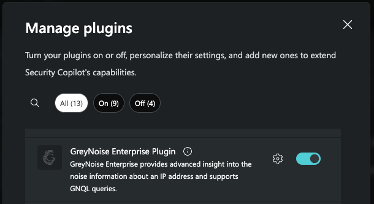
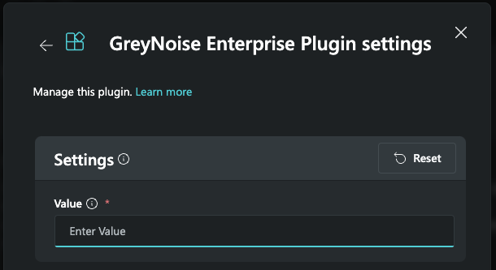

# GreyNoise Enterprise
**Author: Shiv Patel + Brad Chiappetta**

**Publisher: Microsoft + GreyNoise**

This plugin enables users to enrich investigations using threat intelligence from GreyNoise:   
1. Query information on an IP
2. Execute a GreyNoise Query

Product Information:
https://www.greynoise.io/greynoise-product

**Note**  
Ensure you have a GreyNoise subscription with sufficient Search capacity for your usage

## **Pre-requisites**
1. Login to your [GreyNoise Account](https://viz.greynoise.io/account/plan)
2. Access your GreyNoise API key on the [My API Key Tab](https://viz.greynoise.io/account/api-key)
3. Copy the API key to enter into Co-Pilot. 

## Select or upload the attached manifest file into your Copilot for Security console
1. From the Plugin manager, locate the GreyNoise Enterprise Plugin and enable it

    ## Invoking the Plugin and Skills
2. **Important**  
   After selecting or uploading, click the "Set Up" button and enter the copied API key from the Pre-requisites above and press "Save."

3. Use a Natural Language prompt from below examples or use Direct Skill Invocation ("/")

## Skills & Prompts
1. Look up IP context: Ask GreyNoise if this IP is an Internet Scanner
   - Example Prompt(s): Tell me about Ip address [IP] using GreyNoise database, Find the GreyNoise IP Context for IP [IP]
   - Inputs: [IP] 
2. Look up IP quick: Ask GreyNoise for a quick check of this IP
   - Example Prompt(s): Find the GreyNoise for IP [IP] using a quick lookup, Use GreyNoise to do a quick check of [IP]
   - Inputs: [IP] 
3. Look up multiple IPs: Ask GreyNoise for a quick check of multiple IPs
   - Example Prompt(s): Find the GreyNoise for IPs [IP, IP, IP] using a quick lookup, Use GreyNoise to do a quick check of [IP, IP, IP]
   - Inputs: [List of IPs] 
4. Look up IP riot: Ask GreyNoise if this IP is associated with a Common Business Service
   - Example Prompt(s): Use GreyNoise to check the Riot information on IP [IP], I want to know the GreyNoise riot information on IP [IP]
   c
5. Look up GNQL: Query GreyNoise using the GreyNoise Query Language (GNQL)
   - Example Prompt(s): Use GreyNoise to check the GNQL information on [QUERY], Query GNQL for [QUERY], Search for all IPs scanning sensors located in Germany with GNQL GreyNoise Enterprise [QUERY]
   - Inputs: [QUERY]
6. Look up CVE: Use the GreyNoise Query Language (GNQL) stats to query against the GreyNoise dataset for CVE information.
   - Example Prompt(s): Use GreyNoise to check stats on [CVE], What does GreyNoise know about [CVE]
   - Inputs: [CVE]

## Frequently Asked Questions (FAQ)
1. **Important**  
   If prompts fail to invoke, please ensure you're using a supported Prompt above. Otherwise, invoke it using Direct Skill Invocation "/"      
