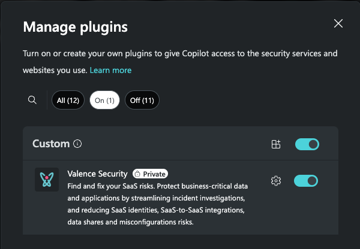
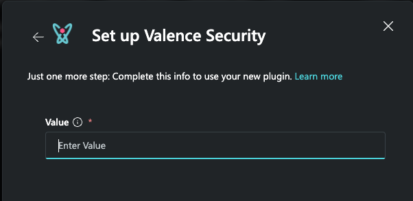

# Valence Security
**Author: Shiv Patel + Shlomi Matichin + Lev Rado**

**Publisher: Microsoft + Valence Security**

This plugin helps users enhance investigations with data from SaaS applications such as Salesforce, GitHub, Okta, Google Workspace and dozens others:   
1. Investigate user activity across multiple SaaS platforms
2. Create reports to understand a specific user's SaaS security posture

Product Information:
https://www.valencesecurity.com/platform

**Note**  
Ensure you have a Valence Security subscription

## **Pre-requisites**
1. Login to your [Valence Security Account](https://app.valencesecurity.com/)
2. Generate new API Key for plugin from [API Keys Setting](https://app.valencesecurity.com/settings/apikeys)
3. Copy the API key to enter Copilot. 

## Select or upload the attached manifest file into your Copilot for Security console
1. From the Plugin manager, locate the Valence Security Plugin and enable it

    ## Invoking the Plugin and Skills
2. **Important**  
   After selecting or uploading, click the "Set Up" button and enter the copied API key from the Pre-requisites above and press "Save."

3. Use a Natural Language prompt from below examples or use Direct Skill Invocation ("/")

## Skills & Prompts
1. Investigate user actions across all SaaS platforms
   - Example Prompt(s): "Which high privileged actions did [USER] take over the past day?", "Show me recent alerts for [USER]"
   - Inputs: [USER] 
2. Create a report for a user in all SaaS platforms
   - Example Prompt(s): "Summarize [USER] security SaaS posture"
   - Inputs: [USER]

## Frequently Asked Questions (FAQ)
1. **Important**  
   If prompts fail to invoke, please ensure you're using a supported Prompt above. Otherwise, invoke it using Direct Skill Invocation "/"      
