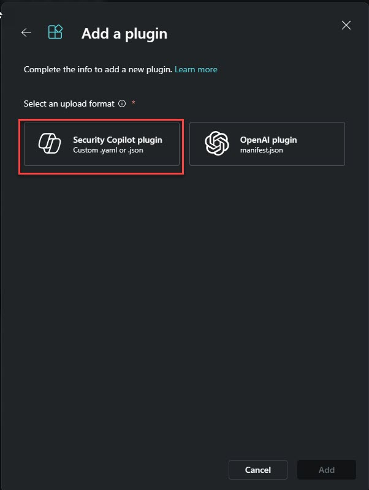

# Introduction

#### ⌛ Estimated time to complete this lab: 10 minutes
#### 🎓 Level: 100 (Beginner)

#### Objectives

Upon completing this technical guide, you will gain the following abilities: 

* Upload a Microsoft Security Copilot custom plugin of the Logic App type. 
* Deploy an Azure Logic App capable of handling Microsoft Security Copilot prompts. 
* Create a Microsoft Security Copilot session that triggers this Logic App. 

#### Scenario
In this technical workshop, participants will learn how to upload a Microsoft Security Copilot custom plugin of the Logic App type and deploy the corresponding Logic App. To successfully complete this task, you must meet the following prerequisites: 

* You need your own tenant and Microsoft Security Copilot instance. 
* You should have permission to upload a custom plugin. 
* You should have permission to deploy a Logic App. 

####  Instruction

## Deploy Logic app 

	1. Deploy the Logic App above by clicking the "Deploy to Azure" button

Select the subscription, resource group and logicapp name.

 

 
	2. Once the Logic App is created, locate it and authenticate the "send email" action with a user who has a mailbox in O365.

    

### Upload the Custom Plugin 

Downalod a local copy of "SendJokeByEmail.yml" file located in the same folder and edit it. 
Add the following information:

1. The SubscriptionId where you deployed your Logic App.
2. The ResourceGroup where you deployed the Logic App.
2. If you changed the default logic app name adapt the logic app name.

3. Upload the custom plugin and check if its turn on

4. **Execute the following prompts:**

* Tell me a security-related joke for today. 
* Run the logic to send the above joke to this email: <youremailaddress@email.com>.. 

5. To monitor the process, open the Logic App you just created and check the last runs.

6. Open your inbox and examine the email. 

###  See you in the next Task!

