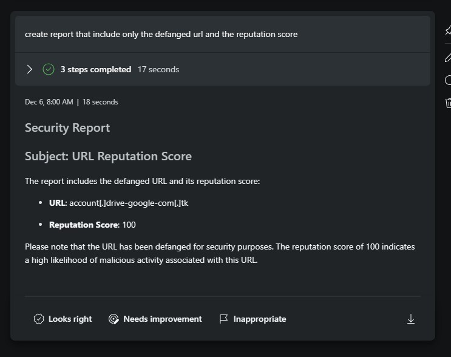

# Introduction 

#### 🎓 Level: 100 (Beginner)
#### ⌛ Estimated time to complete this lab: 10 minutes

### Objectives

Upon completing this technical guide, you will gain the following abilities: 

* Upload a custom plug from GPT type. 
* Learn how to use the fetchUrl skill. 
* Learn how to use the DefangUrl skill. 
* Generete report that will levrage MDTIO data and the custom plugin source. 

### Scenario
In this technical workshop, participants will learn how to upload a Microsoft Copilot for Security custom plugin of the GPT type.  
To successfully complete this task, you must meet the following prerequisites: 

* You need your own tenant and Microsoft Copilot for Security instance. 
* You should have permission to upload a custom plugin. 

###  Instruction
    

#### Upload the Custom Plugin 

1. Obtain the file named **"DefangsURLs.yaml"** from this directory. 
2. Inspect it to appreciate the simplicity of creating a GPT-type plugin. 
3. Upload the custom plugin and verify if it's activated. 

####  Use case

You are an incident response analyst currently investigating a prolonged incident.  
Your colleague has provided you with a Json file containing DNS lookup activity from the DNS server 

**Your task is:** 

1. Fetch DNS information into Copilot Pilot Context session.

> ⭐ Notice:  

To use the FetchURL option, the Public **Web plugin** must be enabled

 

2. Extract only the URLs from this file.
3. Use the MDTI reputation score Skill to assess these URLs.
4. Identify URLs with scores exceeding 75.
5. In order to compile a report with your findings, utilize the custom plugin you recently uploaded to neutralize **(Defang)** the suspicious URLs.

####  How to accomplish this

* Use the "fetchurl" skill to access the file located in the same directory. It's important to ensure you retrieve the raw representation of the file.  
* Use the MDTI skill and the DefangUrl to create report.

####   Example prompt:

1. Fetchurl https://raw.githubusercontent.com/Yaniv-Shasha/SecurityCopilot/main/Workshop/Custom_Plugin/Task02_Defang_URL/UrlstoFetch_Task02.json.  

2. Distinct all the DNS query from this file.  

3. Check reputation score for the above domains.  

4. Defang URL for all the domains with reputation score higher than 75

5. Create report that include only the defanged url and the reputation score.  

####  ✅  Final Results:

