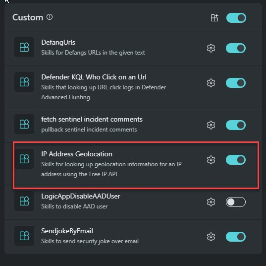

# Introduction 

#### 🎓 Level: 100 (Beginner)
#### ⌛ Estimated time to complete this lab: 10 minutes

### Objectives

Upon completing this technical guide, you will gain the following abilities: 

* Upload a cusotm plug from API type. 
* Learn how to use the fetchUrl skill. 
* Generete report that will levrage the custom plugin source. 

### Scenario
In this technical workshop, participants will learn how to upload a Microsoft Security Copilot custom plugin of the API type.  

> ⭐ Notice:  
**When utilizing a custom plugin from an API type, be aware that data is transferred out of your tenant and sent to a remote endpoint. In this lab, we are working with sample data. Please keep this in consideration when handling internal data.**
 

To successfully complete this task, you must meet the following prerequisites: 

* You need your own tenant and Microsoft Security Copilot instance. 
* You should have permission to upload a custom plugin. 

###  Instruction
    

#### Upload the Custom Plugin 

1. Obtain the file named **"Geo.yaml"** from this directory. 
2. Inspect it to appreciate the simplicity of creating a API-type plugin. 
3. Upload the custom plugin and verify if it's activated. 

####  Use case

You are preparing an enrichment report based on a previous incident. As part of the evidence collection, you have received a file containing lists of IP addresses.  
Your task is to assess the reputation score of these IPs and share the ones with a reputation score exceeding 70.  

Your SOC manager has requested that you include both the IP address and its complete geographical location in the report.  

**Your task is:** 

1. Input this information from the CSV into Copilot Pilot.(use the raw version)
2. Extract only the IPs from this file.
3. Employ the MDTI reputation score to assess these Ips.
4. Identify IPs with scores exceeding 75.
5. In order to compile a report with your findings, utilize the custom plugin you recently uploaded to GeoIP the suspicious Ips.
6. Share report that include the reputation score and the Geo IP data.

####  How to accomplish this

1. Use the **"fetchurl"** skill to access the file located in the same directory. It's important to ensure you retrieve the raw representation of the file.  

####   Example prompts:

1. Fetchurl https://raw.githubusercontent.com/Yaniv-Shasha/SecurityCopilot/main/Workshop/Custom_Plugin/Task03_GEO_IP_report/CiscoSEG.csv  

> ⭐ Notice:  

To use the FetchURL option, the Public **Web plugin** must be enabled

 

  

2. From this file distinct all the DeviceAddress.  

3. Check reputation score for the above Ip's.  

4. Tell me the Geolocation for the IP that its reputation is above 75.  

5. Generate reports that include ip address reputation score and geo location information.  

####  ✅  Final Results:

