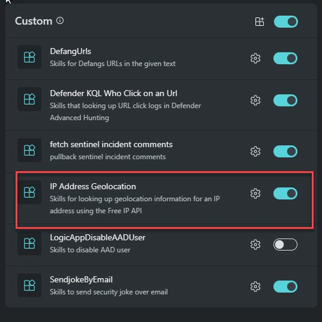
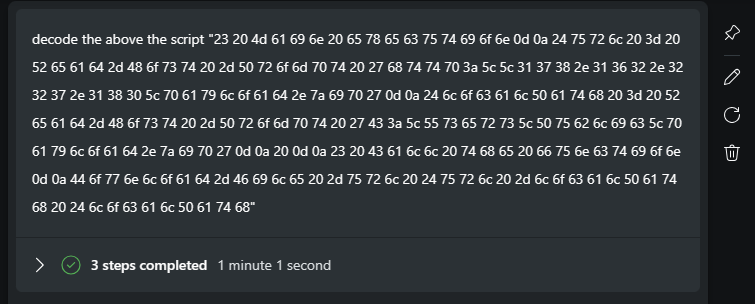
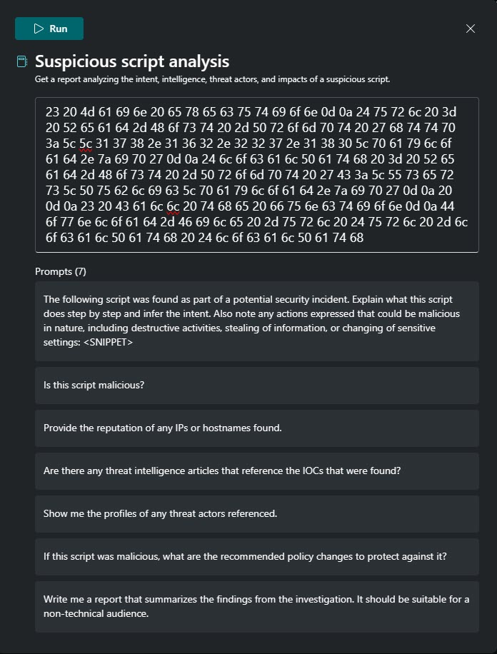

# Introduction 

#### 🎓 Level: 100 (Beginner)
#### ⌛ Estimated time to complete this lab: 10 minutes

### Objectives

Upon completing this technical guide, you will gain the following abilities: 

* Upload a cusotm plug from API type. 
* Learn how to use script analysis promptbook. 
* Learn how to analze and encode Script. 
* Generete report that will levrage the custom plugin source. 

### Scenario
In this technical workshop, participants will learn how to upload a Security Copilot custom plugin of the API type.  

> ⭐ Notice:  
**When utilizing a custom plugin from an API type, be aware that data is transferred out of your tenant and sent to a remote endpoint. In this lab, we are working with sample data. Please keep this in consideration when handling internal data.**
 

To successfully complete this task, you must meet the following prerequisites: 

* You need your own tenant and Security Copilot instance. 
* You should have permission to upload a custom plugin. 

###  Instruction
    

#### Upload the Custom Plugin 

> ⭐ Notice:  
If you have already completed Module 4, there is no need to upload the plugin again. 

1. Obtain the file named **"Geo.yaml"** from this directory. 
2. Inspect it to appreciate the simplicity of creating a API-type plugin. 
3. Upload the custom plugin and verify if it's activated. 

####  Use case

You are Soc Analyst in woodgrove Domain, During an endpoint Incident investigation, you found suspicious script that run on your DMZ server, your job is to analyze this script, and share your final to your team member.  

**Your task is:** 

1. Input this information about the script from the script_decode.txt and ask Copilot to decode it
2. Extract only the IPs from this script.
3. Employ the MDTI reputation score to assess these Ip.
4. Identify IPs with scores
5. In order to compile a report with your findings, utilize the custom plugin you recently uploaded to GeoIP the suspicious Ips.
6. Share report that include the reputation score and the Geo IP data.

####   Example prompts:

1. Decode the above script "Replace this with the script you copied".  

2. check reputation score for the above ip.  

3. Use Geo location for the above IP.  

4. create report that include the reputation score and the Geo Ip address.  

####  ✅  Final Results:

 ⭐**Bouns task:**  

1. Copy the script from script_decode.txt .  

   

2. Launch the 'Suspicious Script Analysis' tool Promptbooks.
3. Paste the script you copied in Step One into the designated field and click 'Run'. 
4. Distribute the generated report and assess whether the script is malicious

