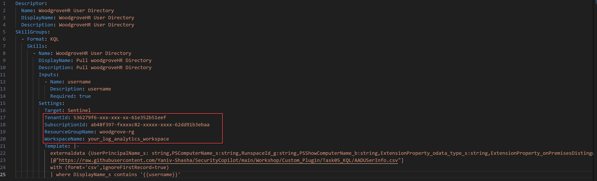
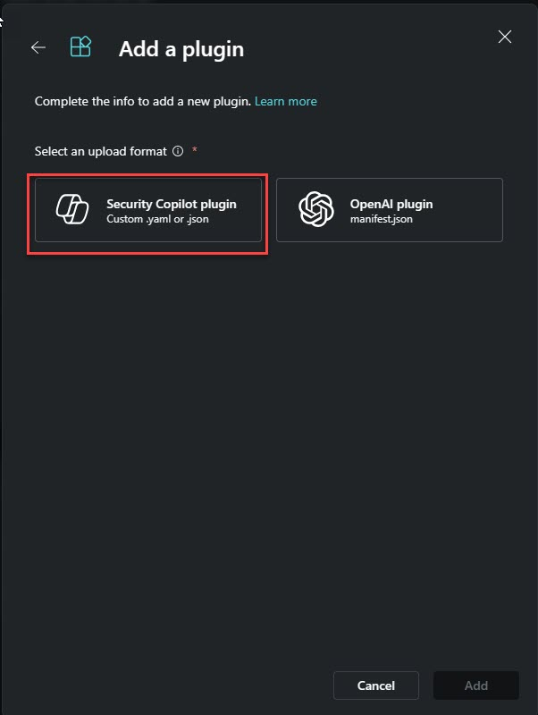
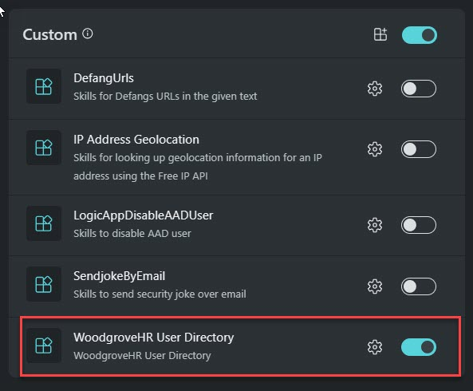
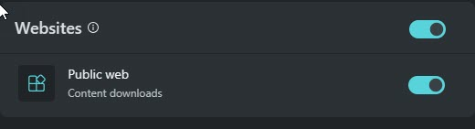
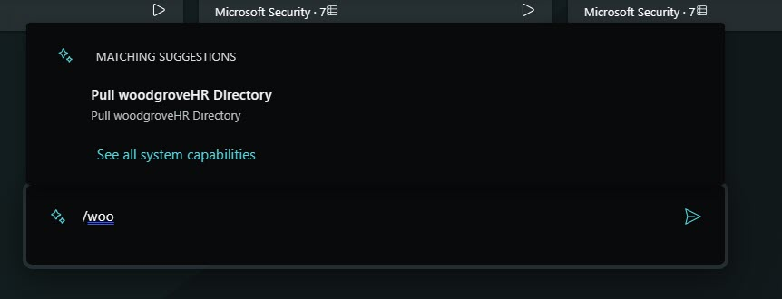
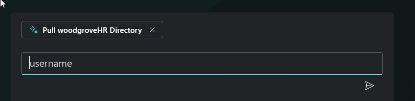
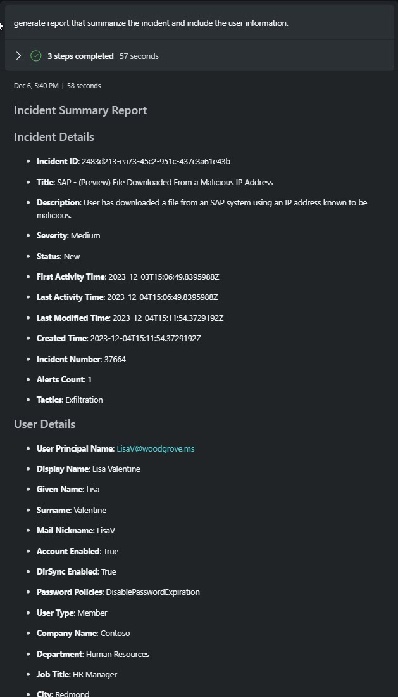

# Introduction 

#### 🎓 Level: 100 (Beginner)
#### ⌛ Estimated time to complete this lab: 10 minutes

### Objectives

After finishing this technical guide, you will acquire the following skills: 

* Ability to upload a custom plugin of the KQL type. 
* Understanding of how to enhance user information using an external user list. 
* Proficiency in generating reports utilizing the custom plugin source. 

### Scenario
In this technical workshop, participants will learn how to upload a Security Copilot custom plugin of the API type.  
To successfully complete this task, you must meet the following prerequisites: 

* You need your own tenant and Security Copilot instance. 
* You should have permission to upload a custom plugin. 

###  Instruction
    

#### Upload the Custom Plugin 

1. Retrieve the file titled **"UsersHR.yml"** from the specified directory.. 
2. Examine a plugin of the KQL type. 
3. Alter the configuration in the YAML file to include your subscription, resource group (where sentinel to deploy), and log analytics workspace (where sentinel is deploy). 

 

> ⭐ Notice:  

To obtain the **Tenant ID, Subscription ID, Resource Group, and Log Analytics Workspace name**, please refer to the Azure documentation.  

4. Upload the custom plugin and confirm its activation. 

 

####  Use case

As a SOC Analyst at Woodgrove Domain, you are involved in investigating an SAP incident. During this investigation, you identified a user engaging in suspicious activity, specifically downloading a file from the SAP system. To respond swiftly, it's crucial to rapidly enrich this user's profile with data from your HR system, known as **WoodgroveHR**.  

Given that this incident occurred in an air-gapped environment, your colleague from Woodgrove-airgap has provided the incident details in a Json format, which you need to access and utilize for further analysis.  

**Your task is:** 

1. Fetch air-gapped sentinel incident into Copilot Session memory. 
> ⭐ Notice:  

To use the FetchURL option, the Public **Web plugin** must be enabled

 

2. Use  **WoodgroveHR User Directory** custom plugin you just uploaded and call it explicitly.   
  Hint: you can do it by typing  **/wood**   

3. Search the victim user from the incident   

4. Generate report that includes the incident summary and the user enriched data from the WoodgroveHR.  

####   Example prompts:

1. Fetch url https://raw.githubusercontent.com/Yaniv-Shasha/SecurityCopilot/main/Workshop/Custom_Plugin/Task05_KQL/Sentinel_Incident.json.  

2. You need to call  explictly the custom skill you uploaded,  by typing **/woodgroveHD**.  

> ⭐ Notice:  
  Hint: you can do it by typing  **/wood**   

3. Add the user name as input paramter for the **/woodgroveHD** plugin.  

4. Generate report that summarize the incident and include the user information.

  

####  ✅  Final Results:

